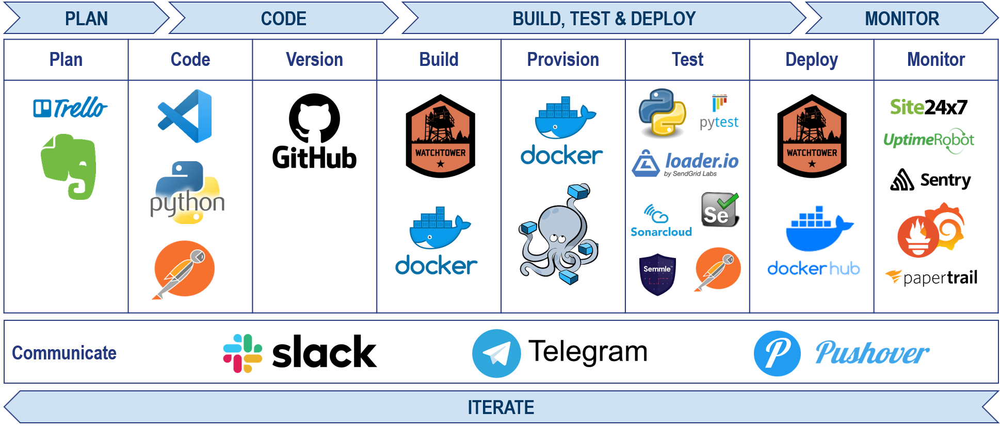

# **My CV API**

A DevOps Project
By: Rich Bocchinfuso

- [GitHub Repo](https://github.com/rbocchinfuso/cv-api)
- [Project Blog](http://gotitsolutions.org/2020/02/06/dominate-thy-destiny/)
- [This Preso-as-Code](https://github.com/rbocchinfuso/cv-api/blob/master/CV-PRESO.md)

---

# My Pipeline



---

# Why


- Just **for fun**
- Because **I can**
- Inflight **boredom** and shitty United WiFi
- Because we **learn by doing**
- Because we live in an **API driven world**
- Because my dad taught me to not expect others to do things you can't do yourself

---

# How


- **Create** a JSON structure for CV details
- **Build** API with Python and Flash
- **Package** and containerize API
- **Test and document** the API with Postman
- **Document** with a good README.md
- **CI/CD** pipeline
- **Test** with lgtm, sonararcloud, loader.io
- **Instrument and monitor** with Sentry, Prometheus and Grafana

---

# Project Overview


- [**config.ini**](https://github.com/rbocchinfuso/cv-api/blob/master/config.ini): Config params; typically excluded from commit with .gitignore
- [**cv-api.py**](https://github.com/rbocchinfuso/cv-api/blob/master/cv-api.py): The applicaiton
- **cv.json**: JSON file containing CV details
- [**CV-PRESO.md**](https://github.com/rbocchinfuso/cv-api/blob/master/CV-PRESO.md): Presentation-as-code :wink:
- [**docker-compose.yml**](https://github.com/rbocchinfuso/cv-api/blob/master/docker-compose.yaml): File that constructs applicaiton infrastucture
- [**Dockerfile**](https://github.com/rbocchinfuso/cv-api/blob/master/Dockerfile): Build app container
- [**README.md**](https://github.com/rbocchinfuso/cv-api/blob/master/README.md): Documentation

---

# CV in JSON


```JSON
{
  "basics": {
    "name": "Richard Bocchinfuso",
    "label": "Engineering Leader",
    "picture": "https://www.amazon.com/photos/...",
    "email": "rbocchinfuso@gmail.com",
    "phone": "(732) 713-5671",
    "website": "http://bocchinfuso.net",
    "summary": "As a passionate and dedicated...",
    "location": {
      ...
      "region": "Northeast"
    },
    ...
  }
  ```

---

# Dockerfile Explained


Pull Alpline Linux image, update and install Python (JeOS)

```Dockerfile
FROM alpine:latest
MAINTAINER Richard Bocchinfuso "rbocchinfuso@gmail.com"
RUN apk add --update \
    python \
    python-dev \
    py-pip \
    build-base \
  && pip install virtualenv \
  && rm -rf /var/cache/apk/*
```

---

# Dockerfile Explained Cont'd

<!--  -->


Copy app code into container.

```Dockerfile
RUN mkdir -p /app
ADD ./cv.json /app
ADD ./config.ini /app
ADD ./cv-api.py /app
ADD ./requirements.txt /app
```

---

# Dockerfile Explained Cont'd

<!--  -->

Set app directory, install requirements, start application.

```Dockerfile
WORKDIR /app
RUN pip install -r requirements.txt
ENTRYPOINT ["python"]
CMD ["cv-api.py"]
```

---

# Docker Compose Explained

Starts NGINX contianer for reverse proxy


```Dockerfile
services:
  nginx-proxy:
    restart: always
    image: jwilder/nginx-proxy
    container_name: nginx-proxy
    ports:
      - "80:80"
    volumes:
      - /var/run/docker.sock:/tmp/docker.sock:ro
```

---

# Docker Compose Explained Cont'd

Starts CV API container and application

```Dockerfile
cv-api:
#   build: ./
    restart: always
#   image: local/cv-api
    image: rbocchinfuso/cv-api:latest
    container_name: cv-api
#    ports:
#     - "5000:5000"
    expose:
     - "5000"
    volumes:
     - .:/code
```

---

# Docker Compose

Registered with NGINX proxy as reverse proxy address

```Dockerfile
environment:
     - VIRTUAL_HOST=cv.bocchinfuso.net
```

Private network on which NGINX communicates with CV API

```Dockerfile
networks:
  default:
    external:
      name: nginx-proxy
```

---
# Nginx Reverse Proxy


docker-compose automagically registers the virtual host with the Nginx container

```json
server {
  listen 80;
  listen [::]:80;

  server_name cv.bocchinfuso.net;

  location / {
      proxy_pass http://localhost:5000/;
  }
}
```

---

# What


- **Deploy NGINX** container and expose port 80
- **Build and deploy cv-api** container from source
- **Expose port 5000 to NGINX** revese proxy
- **Register** virtual hostname "cv.bocchinfuso.net"
- Allow user with bearer token make a CV API REST calls

---

# Demo Time


## :grin: Release the Kraken! :grin:

- Test API Request: http://bit.ly/2wA1Ykw

- Read full API docs: http://bit.ly/2v1b35G


---

# Appendix


- Project Timeline: It's my lifestyle.
- [This Preso-as-Code](https://github.com/rbocchinfuso/cv-api/blob/master/CV-PRESO.md)
- [CV API Trello Board](http://bit.ly/2PTC3uX)

_Note: [GitPitch](https://gitpitch.github.io/gitpitch/#/) is gone :cry:,  so I had to refactor [PITCHME.MD](https://github.com/rbocchinfuso/cv-api/PITCHME.md), which I did using [Marp](https://marp.app/)._
