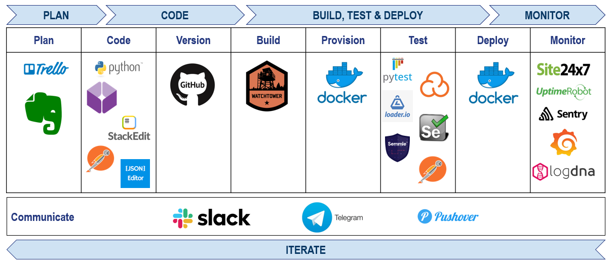

@title[Title Slide]

# My **DevOps** Project

---
@title[The Narrative]

@snap[west span-55]
## The CV API Narrative
@snapend

@snap[east span-45]

@snapend

@snap[south span-100]
https://github.com/rbocchinfuso/cv-api

Learn more here: http://bit.ly/372imHl
@snapend

---?color=linear-gradient(180deg, white 75%, black 25%)
@title[My Pipeline]

@snap[north span-100]

@snapend

@snap[south span-100]
## My Pipeline
@snapend

---
@title[Why?]

@snap[east span-50 text-center]
## Why?
@snapend

@snap[west span-55]
@ul[list-spaced-bullets text-09]
- Just **for fun**.
- Because **I can**.
- Inflight **boredom** and shitty United WiFi.
- Because we **learn by doing**.
- Because we live in an **API driven world**.
- Because my dad taught me to not ask for things you can't do yourself.
@ulend
@snapend

---
@title[What?]

@snap[north-east span-50 text-right]
## How?
@snapend

@snap[west span-100]
@ul[list-spaced-bullets text-07]
- Create a JSON structure to store CV details.
- Build API with Python and Flash
- Package and containerize API
- Test and document the API with Postman
- Write a good README.md
- Build CI/CD pipeline (Desktop -> Github -> Dockerhub build -> Watchtower deploy)
- Test with lgtm, sonararcloud, loader.io
- Instrument and monitor with Sentry, Prometheus and Grafana
@ulend
@snapend

---
@title[My Project]
@code[text zoom-12](./doc/tree.pub)

@snap[east span-50]
## Project Overview
@snapend

@snap[south span-100]
@[4, zoom-11](Config file which stored sensative data and excluded with .gitignore)
@[5, zoom-11](The applicaiton)
@[7, zoom-11](CV JSON file)
@[9, zoom-11](docker-compose.yaml file that constructs applicaiton infrastucture)
@[11, zoom-11](Dockerfile to containerize application)
@[13-14, zoom-11](This presentation)
@[15, zoom-11](README.md that tells others how to use my app)
@snapend

---

@title[CV in JSON]

@code[json](./cv.json)

@snap[north span-100]
## CV in JSON
@snapend

---
@title[Dockerfile]

@code[dockerfile zoom-07](./Dockerfile)

@snap[east span-50]
## Dockerfile
@snapend

@snap[south span-100]
@[1-9, zoom-11](Pull Alpline Linux image, update and install Python (JeOS))
@[10-14, zoom-11](Copy app code into container.)
@[15-18, zoom-11](Set app directory, install requirements, start application.)
@snapend

---

@snap[east span-50 text-center]
## Now It's **Your** Turn
@snapend

@snap[south-east span-50 text-center text-06]
[Download GitPitch Desktop @fa[external-link]](https://gitpitch.com/docs/getting-started/tutorial/)
@snapend

