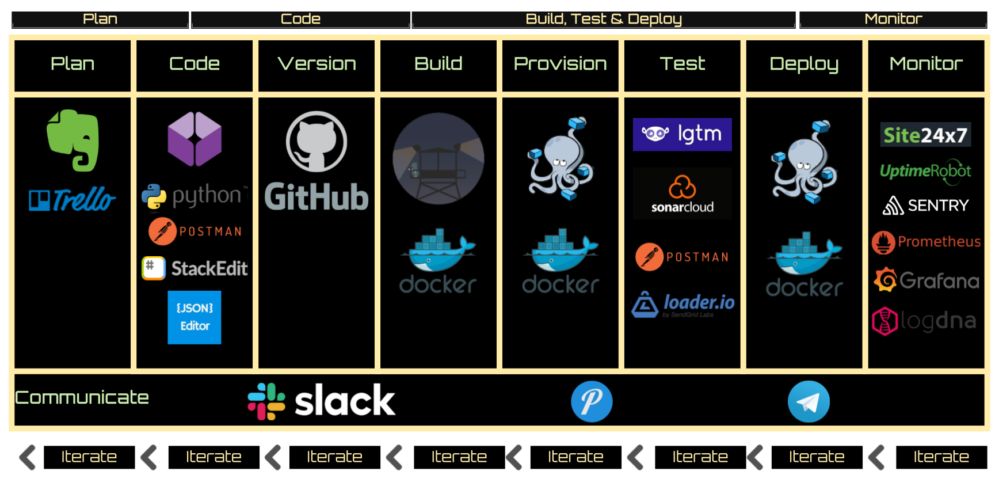
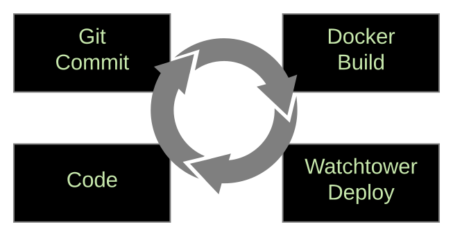

@title[Title Slide]

# My **DevOps** Project

---
@title[The Narrative]

@snap[west span-55]
## The CV API Narrative
@snapend

@snap[east span-45]

@snapend

@snap[south span-100]
https://github.com/rbocchinfuso/cv-api
Learn more here: http://bit.ly/372imHl
@snapend

---
@title[My Pipeline]

@snap[north span-100]
## My Pipeline
@snapend

@snap[span-100]

@snapend

---
@title[Why?]

@snap[north-east span-100 text-right]
## Why?
@snapend

@snap[west span-100]
@ul[list-spaced-bullets text-09]
- Just **for fun**
- Because **I can**
- Inflight **boredom** and shitty United WiFi
- Because we **learn by doing**
- Because we live in an **API driven world**
- Because my dad taught me to not expect others to do things you can't do yourself
@ulend
@snapend

---
@title[How?]

@snap[north-east span-100 text-right]
## How?
@snapend

@snap[west span-100]
@ul[list-spaced-bullets text-07]
- **Create** a JSON structure to store CV details
- **Build** API with Python and Flash
- **Package** and containerize API
- **Test** and document** the API with Postman
- **Document** with a good README.md
- **CI/CD** pipeline
- **Test** with lgtm, sonararcloud, loader.io
- **Instrument and monitor** with Sentry, Prometheus and Grafana
@ulend
@snapend

@snap[east span-40]

@snapend

---
@title[My Project]
@code[text zoom-12](./doc/tree.pub)

@snap[east span-50]
### @color[#e49436](Project Overview)
@snapend

@snap[south span-100]
@[4, zoom-11](Config file which stored sensative data and excluded with .gitignore)
@[5, zoom-11](The applicaiton)
@[7, zoom-11](CV JSON file)
@[9, zoom-11](docker-compose.yaml file that constructs applicaiton infrastucture)
@[11, zoom-11](Dockerfile to containerize application)
@[13-14, zoom-11](This presentation)
@[15, zoom-11](README.md that tells others how to use my app)
@snapend

---
@title[CV in JSON]
@code[json](./cv.json)

@snap[north span-100]
### @color[#e49436](CV in JSON)
@snapend

---
@title[Dockerfile]

@code[dockerfile zoom-07](./Dockerfile)

@snap[east span-50]
### @color[#e49436](Dockerfile)
@snapend

@snap[south span-100]
@[1-9, zoom-11](Pull Alpline Linux image, update and install Python (JeOS))
@[10-14, zoom-11](Copy app code into container.)
@[15-18, zoom-11](Set app directory, install requirements, start application.)
@snapend

---
@title[Dockerfile]

@code[dockerfile zoom-07](./docker-compose.yaml)

@snap[east span-50]
### @color[#e49436](Docker Compose File)
@snapend

@snap[south span-100]
@[2-10, zoom-11](Starts NGINX contianer for reverse proxy)
@[11-24, zoom-11](Starts CV API container and application)
@[24, zoom-11](Registered with NGINX proxy as reverse proxy address)
@[26-29, zoom-11](Private network on which NGINX communicates with CV API)
@snapend

---
@title[Nginx Reverse Proxy]

@snap[north span-100]
### @color[#e49436](Automagic NGINX Config)
@snapend

```text zoom-15
server {
  listen 80;
  listen [::]:80;

  server_name cv.bocchinfuso.net;

  location / {
      proxy_pass http://localhost:5000/;
  }
}
```

---
@title[What?]

@snap[north-east span-100 text-right]
## What?
@snapend

@snap[west span-100 text-09]
@ul[list-spaced-bullets]
- **Deploy NGINX** container and expose port 80
- **Build and deploy cv-api** container from source
- **Expose port 5000 to NGINX** revese proxy
- **Register** virtual hostname "cv.bocchinfuso.net"
- Allow user with bearer token make a CV API REST calls
@ulend
@snapend


---?image=assets/img/code.jpg&opacity=60&position=left&size=45% 100%

@title[Demo Time]

@snap[north-east span-70 text-right]
#### Get ready for some @fa[magic] @color[#e49436](Magic)
##### @color[#A0C865](Demo Time)
@snapend

@snap[south-east span-40 text-left]
Test API Request:
http://bit.ly/2wA1Ykw
Read full API docs:
http://bit.ly/2v1b35G
@snapend

---
@title[Appendix]
@snap[north-east span-50]
### @color[#e49436](Appendix)
@snapend

```markdown
@title[Dockerfile]

@code[dockerfile zoom-05](./Dockerfile)

@snap[east span-50]
### @color[#e49436](Dockerfile)
@snapend

@snap[south span-100]
@[1-9, zoom-11](Pull Alpline Linux image, update and install Python (JeOS))
@[10-14, zoom-11](Copy app code into container.)
@[15-18, zoom-11](Set app directory, install requirements, start application.)
@snapend
```

- My Preso As Code: http://bit.ly/2vNlXfJ
- CV API Trello Board: http://bit.ly/2PTC3uX
- Timeline: A lot. It's my lifestyle.


